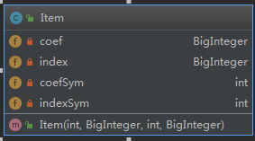
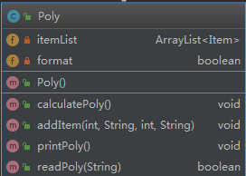
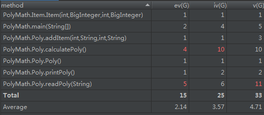
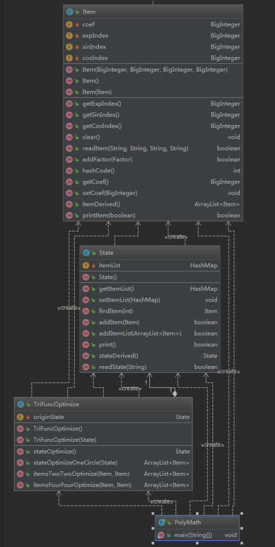
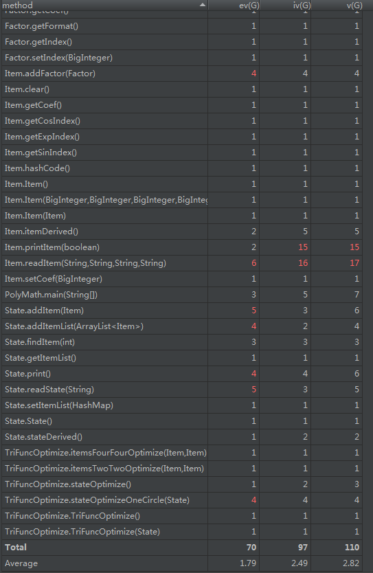
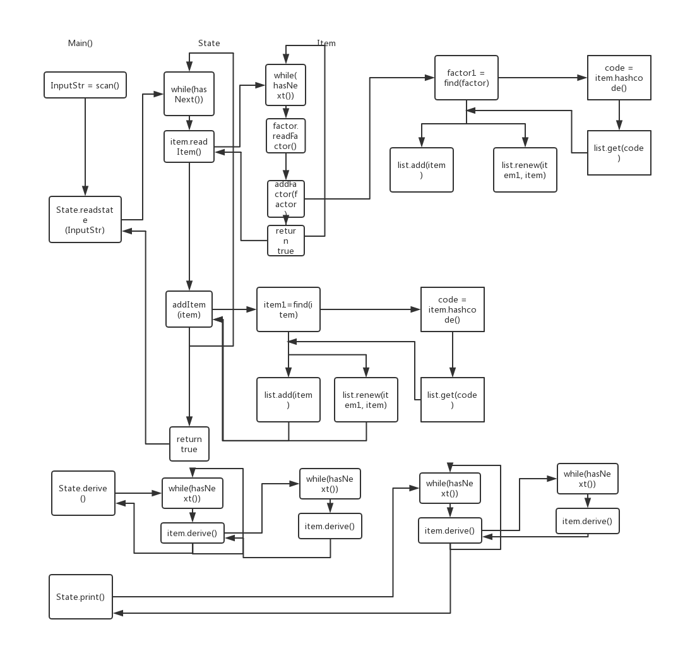

# **OO第一次作业总结**——多项式求导 

**<p align="right"> Author : 16231237 刘子豪 </p>**
**<p align="right"> Finish Date: 2019.03.26 </p>**

## **作业回顾**
***

+ **第一次：** 实现对**仅由幂函数构成**的多项式求导
+ **第二次：** 实现对**包含简单三角函数**的多项式求导
+ **第三次：** 实现对**支持表达式因子的复杂**的多项式求导


## **第一次作业分析**
***

&emsp;&emsp;由于第一次**面向对象**，所以对有些内容的认识并不完全。万幸的是——第一次的多项式求导任务要求不多，仅涉及到简单的幂函数，因此所建立的类的要求也比较简单。

### **类图与复杂度**

&emsp;&emsp;还没从C语言的思路中适应过来，并没有一个对于**对象**的深刻认识。因此在进行设计的时候，出现了类的嵌套，导致设计紊乱。
```code
class PolyMath {
    public class Item { // 项类
        ...
    }

    public class Poly { // 多项式类
        ...
    }

}
```

&emsp;&emsp;对应的相关UML图如下……

 



> *不用说，这是个相当糟糕的设计。*

> *我实在是挑不出来这里面有什么优点*
### **正则表达式**

```code
String pattern = "(\\+|\\-)(\\s)*(\\+|\\-)?" +
                    "(((((\\d+)(\\s)*(\\*)(\\s)*)|\\s*)(x)" +
                    "(\\s)*((\\^)(\\s)*(\\+|\\-)?(\\d+))" +
                    "?(\\s)*)|(\\d+))(\\s)*";
```
由于只涉及到幂函数，因此只需要设置1个pattern即可，对输入的字符串不断用pattern进行匹配，再对匹配到的字符串进行处理分析即可。

该正则表达式默认每一项前面一定有一个+或者-，因此原输入字符串第一字符不是+/-需要进行**人为添加**。

**判断合/非法的方法**：根据匹配字符串返回的start与end数值判断是否合法。*如果有非法字符或者不完全匹配，则后一次的start与前一次的start不相等。*


### **一箩筐的缺点分析**

+ 没有优化：

   - 在进行求导的过程中，很容易出现相关的相同指数的可以合并的项。然而实际在进行存储的过程中，并没有做出对应的操作。即我实现了**最差输出。**

+ 架构问题：

   - 由于没有对程序的对象机制有一个清醒的认识，在本不需要的设计中出现了类的嵌套，对于程序本身并不是一个好的操作习惯。

+ 程序耦合度不高：

   在进行设计时，只针对实现目标要求，而并没有注意到实现方案，导致最后得到的总代码中，重复代码内容过多。


### **从bug中学习**

+ 对象的clone()：
   
   - 在进行对应函数操作时，发现了潜在的存在的对象的**错误赋值。**
   - 举个例子，Item A = (Item)B, 那么对A的相关内容进行修改时，B的内容也会被修改。因为**A与B本身就是一个对象**，这一点通过调试之后被发现。
   - 因此，最好的获取一个对象的复制的方法就是实现clone()函数，复制源对象中的所有内容并重新进行对对象的赋值。

+ ==与equals：

   - ~~==用多了就忘记了equals()方法~~
   - Java的所有操作内容都是**对象**，而不是数值，*这是我犯得最智障的错误*。
   - 在进行对系数是否为负的判断时，使用的表达式是——
   
   ```code
   if (m.group(12) == "-") // m是对应的正则表达式得到的匹配
   ```

   - 而实际上在调试过程中发现，相等的条件是**两个内容指向同一个对象**，而m.group(12)对应的是一个String类型的对象，而“-”是一个Charsequence，因此这个条件是不能成立的。
   - **因此正确的判断方法是——m.group(12).equals("-")**

+ BigInteger的四则运算

   - ~~尽管不忍心接受~~，但是BigInteger类型的四则运算的确是通过返回值来实现数值更新的。

### **数据测试**

&emsp;&emsp;由于~~没进行合并同类项~~，因此只需要一项一项进行对比即可。根据正则表达式使用python生成诸多Item，并将生成的字符串输入到程序入口并进行判断即可。

### **不像总结的总结**

第一次作业完整地诠释了一个字——**菜！**

## **第二次作业分析**
***

经过一周的周四，被老师批评了架构设计之后，重新推翻原有架构开始重新设计……

考虑到这一次的作业新要求——

+ 支持简单三角函数sin(x),cos(x)
+ 允许表达式的项由多个因子相乘

再结合上一次任务的失败之处emmmmmm，这次需要改的东西就比较多了。

### **类图与复杂度分析**





（注：在最终设计中并未使用Factor类）

**说实话，这次设计依旧辣鸡emmm**

### **设计思路**

简易类的结构如下——
```code
   class PolyMath {
       main()
   }

   class Item { // 项
       coef; // 系数
       expIndex; // 幂函数的指数
       sinIndex; // 正弦函数的指数
       cosIndex; // 余弦函数的指数
   }

   class State { // 表达式
       itemList; // 项的列表
   }
```

#### **为什么没有设置Factor类**

在正常设计中，Item应该有一项为FactorList，（~~当然最初就是这么打算的~~）用于存储该项所包含的所有因子。然而在思考后发现，*由于设计需求简单*，所有正余弦函数中的变量仅有一个x，因此只需要单独统计三类函数的指数和即可。其实这样设计还有另一个原因，即合并同类项时便于判断，**hashcode()比较好写**这才是事实。

但是问题也出现了——**程序的移植性变差**，这也是一个严重的失误。

#### **正则表达式**

由于加入了诸多项类型，因此正则表达式也得~~大改特改~~。
```code
String strOne = "((\\+|\\-)(\\t| )*((\\+|\\-)(\\t| )*)?)";
String strIndex = "((\\^)(\\t| )*(\\+|\\-)?(\\d+)(\\t| )*)";
String strConst = "((\\+|\\-)?(\\d+)(\\t| )*)";
String strX = "((x)(\\t| )*)";
String strSin = "((sin)(\\t| )*(\\((\\t| )*(x)(\\t| )*\\))(\\t| )*)";
String strCos = "((cos)(\\t| )*(\\((\\t| )*(x)(\\t| )*\\))(\\t| )*)";
String strFactor = "(((" + strX + "|" + strSin
                + "|" + strCos + ")" + strIndex + "?)|"
                + strConst + ")";
String strMultFactor = "((\\*)(\\t| )*(((" + strX + "|"
                + strSin + "|" + strCos + ")" + strIndex
                + "?)|" + strConst + "))";
String strItem = strOne + strFactor
                + strMultFactor + "*";
```

然而这个正则表达式问题颇多……具体在后面进行分析。

#### **合并同类项处理**

上一次作业中没做同类项合并，性能分拿了可怜的不行的3+，这次终于下决心好好做合并了。

由于合并的要求需要是三个指数都相等，因此判断时只需要根据这**三个指数和进行判断即可**。在对Item进行存储时，重写hashcode()，HashMap<Item, String>可以方便检索并且找到是否存在可以与之合并的项。

而hashcode()设计也极其简单——

`"-expIndex+sinIndex+cosIndex"`

#### **三角函数化简**

> *不做三角函数化简的求导是没有灵魂的。* ——一个不愿意透露姓名的人

对三角函数进行化简，无外乎使用三角函数的相关性质，可能用于化简的公式有……
+ (1)&emsp;sin(x)^2 + cos(x)^2 = 1
+ (2)&emsp;sin(x)^4 + cos(x)^4 = 1 - 2sin(x)^2 + 2sin(x)^4
+ (3)&emsp;sin(x)^3 + cos(x)^3 = sin(x) + cos(x) - sin(x)^2cos(x) - sin(x)cos(x)^2
+ ...


参考了网上诸多大神们讨论的意见，如何对三角函数进行化简。思虑了很久之后，我的选择和大多数人的选择一样，使用公式（1）的化简。原因比较简单，因为**这个化简一定得到更优解。** 确定了这一方针之后，只需要单独设置一个对三角函数进行化简的类，并设置函数，遍历State的itemList找到可以合并的项。**反复迭代n次后**，可以得到一个不能够再化简的表达式，即最终输出结果。（最终设计n=3）

> *欧拉公式是什么？n + m - p = 2吗？* ——另一个低调的人

看到有人在用欧拉公式做化简，我只想说——

> *复数什么的最讨厌了23333！*

### **改不掉的缺点——代码**

功能的确正确了，但是代码依旧不是一个好的代码。着重体现在对过程实现中，封装度很差，~~重复的过程被反复敲打真2333好费时间~~，而且方法特别长看着也难受，不写注释也特别难看的懂。

### **蜜汁bug分析**
***

#### **神奇的省略1**

作业要求中提到——
+ 第一项为1时，可以省略全部或者只显示+
+ 第一项为-1时，可以表示为-

于是产生了一个问题——在识别项的时候，需要考虑到这个可能**隐性存在**的+/-。他们并不是合法的pattern，**但在第一项却是合法项的一部分**。

就很绝望，**不得已对于因子的读入，必须要做出区分……**
```code
String strFactor = "(((" + strX + "|" + strSin
                + "|" + strCos + ")" + strIndex + "?)|"
                + strConst + ")";
String strMultFactor = "((\\*)(\\t| )*(((" + strX + "|"
                + strSin + "|" + strCos + ")" + strIndex
                + "?)|" + strConst + "))";
String strItem = strOne + strFactor
                + strMultFactor + "*";
```

#### **刚提醒完自己就又忘了的clone()**

第一次作业的时候明明发现了这个问题，然而这次缺犯了个clone()的设计错误。

State里面有itemList，存储所有的item。尽管对State进行了clone()，但是并未对itemList也进行clone()，也就是说，**尽管State不同，但itemList指向同一个空间**，导致改了前面的也改了后面的。

这个问题在进行三角函数化简时被挖掘了出来。（**别问，问就是我菜**）


## **第三次作业反思**
***
这次作业不好意思叫分析了，原因很简单——**Wrong Answer**

程序是不存在优点的，不可能有优点的。那干脆就说说自己的心路历程好了。

### **第一部分——架构**

#### **（类）**

> *OO千万条，架构第一条。涉及不规范，修改两行泪。*

对于每个程序设计者来讲，**顶层设计**是必须要学会的东西，所以第一步我尝试着去手工建立类图。

由于这次作业允许表达式因子的出现，因此对类与类之间的继承关系进行修改。

+ Factor
   - ExpFunc ：幂函数
   - ConstFunc ：常数项
   - SinFunc ：正弦函数
   - CosFunc ：余弦函数
   - MixFunc ：混合函数
      + State ：表达式
   - Item ：项

这个设计中，**最大的败笔**就是——**所有类都继承Factor**，这也是后来我最苦恼的地方。看似State继承Factor有合理性，但是把它按照*f(x) = x, g(x) = ..., f(g(x)) = ......* 来理解实在是有点勉强。

#### **流程图设计**

大致的流程图设计如下——



> *这是个完美的设计吧？* ——一个外行这么说……

这个设计还说得过去，似乎该有的都有了，方法的实现顺序也基本都差不多吧。

### **第二部分——详细设计**

#### **方法设计**

写方法的时候，最头疼的就是如何写……

**继承设计不好就会混乱**，我觉得这话说得一点问题都没有。由于继承的存在，函数的返回值，参数值变得千奇百怪，在设计对应函数时要时刻保证，**不仅静态编译可以通过，而且程序运行不能出错**。对Item的addFactor()函数来讲，返回值类型到底是Factor类型还是Item类型，在程序运行的时候，会不会出现类型的错误呢？继承时的上下转换会不会出现丢失&类型不符的问题？我删删改改弄了很久，~~却还是没弄明白还在出错~~。

**值的更新是否使用返回值**？这是我犹豫了很久的第二个问题。求导这种方法肯定是返回值无疑了，**可表达式的乘法，加法呢**？如果采用返回值，那么就需要无休止次数的clone()，对时间空间都是极大的浪费。可如果采用修改对象值的方法，对于表达式*表达式这种需要单方面遍历的该如何处理？？这样会存在巨大的漏洞。（程序进入死循环）

**hashcode()怎么写**？由于表达式因子的出现，这次的hashcode()会特别难处理。每一个混合函数的内容都必须完全对应，思考了很久都没有想过该怎么实现。最后想了个最简单的方法——~~放弃合并~~。

**优化**？别想了你hashcode都不写了就别想着优化的事情了。

#### **正则表达式**

> *真香！*

按照原有的设计，表达式由项+项……得到，而在这次任务中项也可以由表达式*表达式得到，**正则表达式出现了循环**，无法进行正常的pattern匹配。

么得办法，按照其他大佬们给的建议，先用+分项，再用*分因子的方法划分一个又一个的因子来进行处理。（早知道可以这么处理我当初为何要写的那么复杂）

### **第三部分——调试一时爽，一直调试一只爽**

我承认，这一次作业写的的确是**心态爆炸**，并不是题目难，而真的是自己设计出现了比较严重的错误吧。

1. 对State和Item的四则运算在进行处理时，反复修改返回值类型，改来改去始终没得到一个比较好的解决方案。（最后是勉强凑活了）
2. 对类的继承、接口进行了尝试，却无奈并不熟悉，静态编译始终在出问题。而且存储的结构设计也比较让人头大……
3. **读错题了**，误认为sin与cos里面只能是x或者带括号的表达式，而忽略了**项也可以作为因子**。

## **总结**
***
> *最绝望的事情是，比你优秀的人还比你努力*。

一次作业暴露出来我在OO学习上的诸多问题，我也承认自己学的很差，还需要向大佬们取经。最后也只能说——
> *革命尚未成功，同志仍需努力。*